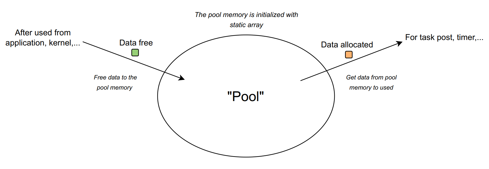
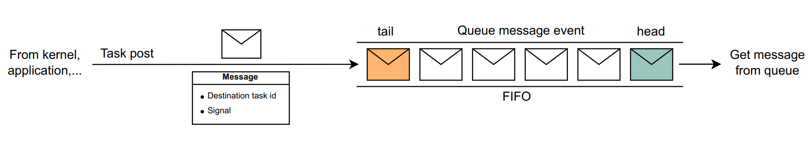

## STK - The Simple Tasker Kernel
STK (Simple Tasker Kernel) is a kernel that manage tasks in the system based on the event-driven programming model including the following mechanisms:
- Post messages to tasks (messages will be stored in a queue)
- Post messages to tasks with timer system tick
- Handle messages based on event queue

To approach this model, learners need to have basic knowledge of data structures: Linked list, queue, pool memory, OOP.
This commit will include the following contents:
- Pool memory
- Post & handling messages mechanisms
- Timer list

### 1. Pool memory:
Optimizing memory when programming is very necessary. Controlling memory will help the program operate efficiently, helping to optimize costs when choosing a microcontroller.

<div style="text-align: center;">
    
</div>

In this kernel, pool memory will be used to manage memory. 
In pool memory, memory will be allocated once upon initialization, called the "pool".

When memory is needed to allocate for processing, the kernel will take it from the pool and after processing will return the memory to the pool. Functions to handle memory allocation and free in the kernel:
```sh
/* allocate memory */
stk_msg_t* get_pure_msg();

/* free memory */
void free_pure_msg(stk_msg_t* pure_msg_free);
```
### 2. Task post
When calling the task post function, the kernel will proceed to send the contents of a message to the queue.

<div style="text-align: center;">
    
</div>

```sh
/* send pure message */
void task_post_pure_msg(task_id_t des_task_id, uint8_t signal);
```

The content of a message includes:
- Destination task id
- Signal

In which destination task id is the destination of the task to handle and signal is the content of the work to be processed.
The scheduler reads messages from the queue for processing according to the FIFO (“first in, first out”) principle.

<div style="text-align: center;">
    
</div>

### 3. Timer
<div style="text-align: center;">
    
</div>

Timer is the service in event-driven programming model. In many contexts, tasks need to be performed periodically at certain intervals. Timer is very easy to use, can be called anywhere to periodically post signals (events) to tasks.

Timer in the kernel will be called by timer system tick. At task timer tick, the handler will check the messages of the timer list and parser timer message (type, period, task id,...) and post message to corresponding task.

Functions in timer:
```sh
/* timer post */
uint8_t timer_set(task_id_t des_task_id, timer_sig_t sig, uint32_t duty, timer_type_t timer_type);

/* remove timer */
uint8_t timer_remove(task_id_t des_task_id, timer_sig_t sig);
```
When calling the timer set function, the kernel will proceed to send messages similar to task post according to the set cycle.
There are two types of timer sends:
- TIMER_ONE_SHOT: only send message once (will be deleted after post signal to task).
- TIMER_PERIODIC: sent periodically with the set period.

When calling the remove timer function, the kernel will proceed to delete the message to be deleted from the timer list.